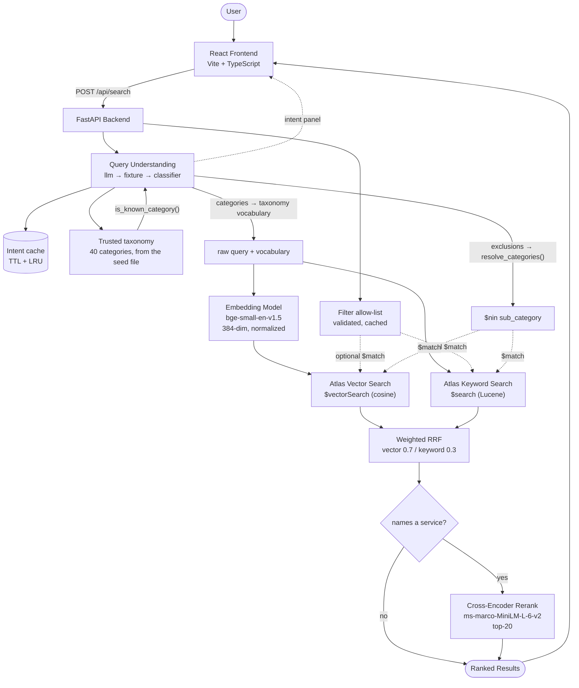
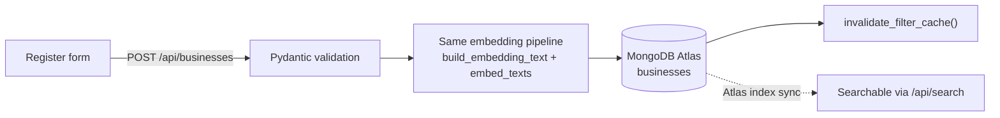

# Natural Language Business Search System

Contextual search over a business directory. Describe a **situation** in plain
English — *"my employees keep clicking suspicious links"*, *"I don't want
cybersecurity companies, I need someone to train my staff"* — and the system works
out what you actually need, tells you what it understood, and ranks businesses
that solve it.

Built as an AI Engineer take-home. The interesting part is not that it returns
results; it's that **every ranking decision is backed by a measured evaluation**,
including the ones that didn't work — and several that looked right and were
then disproved.

---

## Table of contents

- [**Codebase map**](CODEBASE_MAP.md) — file-by-file map of features (start here for review)
- [Problem statement](#problem-statement)
- [Features](#features)
- [Tech stack](#tech-stack)
- [Architecture overview](#architecture-overview)
- [Search pipeline](#search-pipeline)
- [Folder structure](#folder-structure)
- [Installation](#installation)
- [Environment variables](#environment-variables)
- [Running the backend](#running-the-backend)
- [Running the frontend](#running-the-frontend)
- [API documentation](#api-documentation)
- [Screenshots](#screenshots)
- [Evaluation results](#evaluation-results)
- [Performance metrics](#performance-metrics)
- [Deployment guide](#deployment-guide)
- [Future improvements](#future-improvements)

---

## Problem statement

A directory of 120 businesses is only useful if people can find the right one.
Keyword search fails the way users actually type:

- **Vocabulary mismatch.** A user searching *"computer hacking defense"* needs the
  business whose profile says *"cybersecurity, penetration testing, SOC"* — zero
  shared keywords.
- **Intent, not tokens.** *"a place to stay overnight during my business trip"*
  means Hotels. A keyword engine sees the word "business" and matches an
  insurance company.
- **Structured filters still matter.** "Manufacturers in Pune" is a legitimate
  narrowing that pure semantics shouldn't throw away.
- **Symptoms, not services.** *"my employees keep clicking suspicious links"*
  names no service at all. Embeddings cannot bridge that on their own: measured
  on this corpus, a bi-encoder scores that query 0.543 against the correct
  category and scores literal gibberish 0.532. There is no threshold in that gap.
- **Negation.** *"I don't want cybersecurity companies"* embeds at cosine
  **0.945** to the same sentence without the "don't" — and adds the word
  *cybersecurity*, actively pulling in what the user just rejected. Vector search
  has no way to represent "not".

So the system needs semantic understanding *and* exact-term recall *and*
structured filtering *and* an explicit layer that decides what the user actually
meant — without any one of them wrecking the others. The whole project is an
exercise in proving which combination actually ranks best rather than assuming.

---

## Features

| Feature | What it does |
|---|---|
| **Semantic search** | Embeds the query and the business corpus into the same 384-dim vector space; matches on meaning, not tokens. |
| **Hybrid search** | Runs vector search and Atlas keyword search concurrently, fuses with Reciprocal Rank Fusion. |
| **Tuned hybrid** | Score-threshold gating on weak keyword hits, weighted RRF favouring semantics, keyword search narrowed to discriminative fields. |
| **Cross-encoder reranking** | Rescores the fused top-20 by full (query, document) attention. Toggle-able; ships on because the eval says it earns its place. |
| **Dynamic filters** | Industry / City / State / Nature / Sub Category, validated against a live allow-list derived from the DB (also closes a NoSQL-injection-shaped gap). |
| **Query understanding** | An LLM constrained to a closed 40-category taxonomy turns a described situation into structured intent — need, categories, exclusions — *before* retrieval runs. Swappable provider; falls back to an embedding classifier, then to nothing. |
| **Visible reasoning** | The UI shows *"I understood you need…"* with the inferred categories and the provenance of that inference, so a correct result is distinguishable from a lucky match. |
| **Negation / exclusions** | *"I don't want cybersecurity companies"* removes that whole category from results. The exclusion is mapped through the trusted taxonomy first — never substring-matched against business text. |
| **Intent-aware expansion** | Retrieval widens the query with the inferred categories' **taxonomy vocabulary**, not the model's free-text prose — the prose is measurably unstable (see below). |
| **Query-conditional reranking** | The cross-encoder runs only on queries that name their service, because it was measured to *hurt* symptom queries. |
| **Intent cache** | In-process, TTL + LRU bounded. 2216 ms → 0 ms on repeat, and it pins a stochastic model to one answer per query. |
| **Evaluation framework** | 30 golden queries across 6 categories, plus situational, determinism, expansion and contextual suites. Every ranking change is gated on it. |
| **Business registration** | `POST /api/businesses` embeds and stores a new business so it's searchable immediately, through the same pipeline. |
| **React interface** | Intent panel, filters, registration form, and full loading / empty / error states. Deliberately **no** query-term highlighting — see [Why there is no keyword highlighting](#why-there-is-no-keyword-highlighting). |

---

## Tech stack

**Backend** — Python 3.11+, FastAPI, Pydantic v2, PyMongo, `uv` for dependency
management.

**Search / ML** — MongoDB Atlas Vector Search (`$vectorSearch`) + Atlas Search
(`$search`, Lucene); `sentence-transformers` with
[`BAAI/bge-small-en-v1.5`](https://huggingface.co/BAAI/bge-small-en-v1.5) as the
bi-encoder embedder (384-dim, L2-normalized) and
[`cross-encoder/ms-marco-MiniLM-L-6-v2`](https://huggingface.co/cross-encoder/ms-marco-MiniLM-L-6-v2)
as the reranker. Both run locally on CPU, no API key, no per-query cost.

**Query understanding** — an LLM constrained to a closed taxonomy, reached
through a ~150-line vendor-neutral `httpx` client (Anthropic Messages or any
OpenAI-compatible endpoint; verified against DeepSeek by configuration alone).
Entirely **optional**: with no key set, the system falls back to an embedding
classifier and search is unaffected.

**Frontend** — React 19, TypeScript, Vite. No UI kit, no state library, no HTTP
client — `fetch` and plain CSS keep the dependency surface minimal.

---

## Architecture overview



Vector search and keyword search run **concurrently** (a two-worker
`ThreadPoolExecutor`), not in sequence — both feed the fusion stage. Reranking is
a strictly additive stage after fusion; if the cross-encoder fails to load or
infer, search degrades to un-reranked hybrid results rather than erroring.

The intent layer is **additive in exactly the same way**. Any failure — no API
key, timeout, unparseable JSON, a category outside the taxonomy — returns no
intent, and search proceeds as it did before the layer existed. It can cost the
user their explanation; it can never cost them their results.

Two trust boundaries are worth naming, because they are the difference between a
feature and a vulnerability:

- **The taxonomy is generated from the checked-in seed dataset, never from the
  database.** `POST /api/businesses` is unauthenticated and `sub_category` is
  free text, so a collection-derived taxonomy would let any stranger place text
  inside every user's LLM prompt.
- **Every category the model returns is re-checked** with `is_known_category()`.
  A prompt instruction is not an access control — a model can emit any string,
  and unknown ones are discarded.

**Registration write path:**



---

## Search pipeline

1. **Understand the query.** An LLM constrained to the closed 40-category
   taxonomy returns structured intent: `underlying_need`, `service_categories`,
   `exclusions`, `confidence`. Cached per normalised query. If it is
   unconfigured or fails, an embedding classifier answers instead — and if that
   is not confident either, the pipeline simply continues without intent.
2. **Resolve exclusions.** Each exclusion string is mapped onto a trusted
   category by `app/taxonomy.resolve_categories()`, matching **only** against
   taxonomy names. `"cybersecurity companies"` → `Cybersecurity`;
   `"WhatsApp bot companies"` maps to nothing and therefore filters nothing.
   Resolved categories become a `$nin` on `sub_category` inside the aggregation.
3. **Expand the query.** The user's raw words plus the inferred categories'
   **taxonomy vocabulary** — checked-in text, not the model's prose. This is the
   symptom-to-service bridge, and keeping the raw query in front preserves
   specifics the vocabulary cannot carry.
4. **Embed.** `bge-small-en-v1.5` encodes the expanded query to a 384-dim
   L2-normalized vector. The document side was embedded at ingest from
   `business_description + products_services + keywords + specialties +
   sub_category` — contact fields are excluded because they carry no semantic
   signal.
5. **Validate filters.** Any supplied filter value is checked against a live
   allow-list of actual DB values. Anything outside it is rejected with `422`,
   never passed through as a raw query clause.
6. **Retrieve, concurrently.**
   - `$vectorSearch` over the `embedding` field (cosine).
   - `$search` over `keywords`, `specialties`, `products_services` — deliberately
     narrowed; `business_description` carries templated boilerplate that produced
     coincidental matches.
   - Weak keyword hits are dropped before fusion (must score ≥30% of the query's
     own top keyword score — Atlas `searchScore` has no fixed cross-query scale,
     so the threshold is relative).
7. **Fuse with weighted RRF.** `score = Σ weight / (60 + rank)`, with vector
   weighted `0.7` and keyword `0.3`. Rank-based fusion is scale-free, which is
   why it can combine two incomparable scoring systems at all. Results are tagged
   `matched_via`: `semantic`, `keyword`, or `both`.
8. **Rerank — but only if the query names its service.** The cross-encoder scores
   each `(query, document)` pair with full attention, and fusion deliberately
   returns a *wider* pool than the requested limit so a candidate ranked #15 can
   climb into the top 10. It runs **conditionally**: measured on symptom-only
   queries it was a net *negative* (P@5 0.244 with reranking vs 0.378 without),
   because it shares the bi-encoder's world-knowledge ceiling. The switch is the
   classifier's own similarity gate, which separates the two query classes.
9. **Return the top N**, plus the intent for display.

**Why each stage exists** is documented with the evaluation that justified it —
see [Evaluation results](#evaluation-results). The short version: hybrid alone
scored *worse* than vector-only, tuning recovered about half the gap, reranking
closed the rest, and the intent layer is what finally moved symptom queries.

### Why there is no keyword highlighting

The UI used to mark query terms in yellow. It was removed, not restyled. The
highlighting matched the **raw query literally**, independent of how a result was
retrieved — so a document found purely by vector similarity still showed literal
term marks next to a "Semantic" badge. On this corpus the effect was actively
misleading: the descriptions are templated, so a query containing the word
*business* marked it in **120 of 120** documents — the least discriminative word
in the dataset, painted onto every result. `matched_via` is the honest signal for
how something matched, and it comes from the retrieval layer rather than from
string matching in the browser.

---

## Folder structure

```
.
├── README.md                     # this file
├── design-doc.md                 # initial design
├── design-doc-v2.md              # revised design (source of truth for decisions)
├── roadmap.md                    # milestone plan
├── Business_..._120_Companies.xlsx   # source dataset
│
├── backend/
│   ├── README.md                 # deep backend documentation
│   ├── pyproject.toml            # deps (uv)
│   ├── .env.example
│   ├── app/
│   │   ├── main.py               # FastAPI app, routes, CORS, model warm-up
│   │   ├── search.py             # hybrid retrieval + weighted RRF + rerank hook
│   │   ├── embeddings.py         # bi-encoder singleton, build_embedding_text
│   │   ├── reranker.py           # cross-encoder singleton + rerank_candidates
│   │   ├── registration.py       # business registration write path
│   │   ├── filters.py            # live filter allow-list + cache invalidation
│   │   ├── schemas.py            # Pydantic request/response models
│   │   ├── db.py                 # Mongo client singleton
│   │   └── constants.py          # model names, embedding dimensions
│   ├── scripts/
│   │   ├── seed.py               # xlsx ingest + embedding backfill
│   │   ├── eval.py               # golden-query evaluation harness
│   │   ├── eval_dataset.py       # 30 golden queries + relevance judgments
│   │   ├── create_atlas_indexes.py
│   │   ├── verify_atlas_spike.py
│   │   └── atlas_indexes/        # index definitions (JSON)
│   └── eval_reports/             # generated evaluation reports
│
└── frontend/
    ├── README.md
    ├── package.json
    ├── .env.example
    └── src/
        ├── api/                  # HTTP client + typed endpoint functions
        ├── types/                # API contract types (mirror schemas.py)
        ├── hooks/                # useSearch, useFilterOptions, useRegistrationForm
        ├── components/           # SearchBar, FilterPanel, IntentPanel, ResultCard, ...
        ├── pages/                # SearchPage, RegisterPage
        ├── App.tsx               # shell: nav + view switch
        └── index.css             # single organized stylesheet
```

---

## Installation

**Prerequisites:** Python 3.11+, Node `^20.19` or `>=22.12` (required by Vite 8),
a MongoDB Atlas cluster (the free M0 tier is enough), and
[`uv`](https://docs.astral.sh/uv/).

```bash
git clone https://github.com/Harsh-Shah-04/Natural-Language-Business-Search-System.git
cd Natural-Language-Business-Search-System
```

**Backend:**

```bash
cd backend
uv sync                                  # install dependencies
cp .env.example .env                     # then fill in MONGODB_URI
uv run python scripts/create_atlas_indexes.py   # create both Atlas indexes
uv run python scripts/seed.py                   # ingest 120 businesses + embeddings
```

The first run downloads the models (~135MB embedder, ~92MB reranker) from
Hugging Face and caches them locally.

**Frontend:**

```bash
cd ../frontend
npm install
```

---

## Environment variables

**`backend/.env`**

| Variable | Required | Default | Purpose |
|---|---|---|---|
| `MONGODB_URI` | **yes** | — | Atlas connection string. Never commit this. |
| `DB_NAME` | no | `business_search` | Database name. |
| `CORS_ALLOW_ORIGINS` | no | `http://localhost:5173,http://127.0.0.1:5173` | Comma-separated allow-list of frontend origins. |
| `RERANK_ENABLED` | no | `true` | Kill switch for cross-encoder reranking. Wins over `RERANK_POLICY`. |
| `RERANK_POLICY` | no | `intent-gated` | `intent-gated` \| `always` \| `never`. See [Evaluation results](#evaluation-results). |
| `INTENT_PROVIDER` | no | `auto` | `auto` (llm → fixture → classifier), `llm` (strict, no fallback), `embedding`, `fixture`, `off`. |
| `INTENT_EXPANSION_ENABLED` | no | `true` | Widen retrieval with the inferred categories' taxonomy vocabulary. |
| `INTENT_CACHE_SIZE` | no | `512` | LRU bound on cached intents. |
| `INTENT_CACHE_TTL_SECONDS` | no | `3600` | TTL for a cached intent. |

**LLM provider** — all optional. Leave `LLM_API_KEY` unset and the system runs
without an LLM: `auto` falls through to the classifier and search is unaffected.

| Variable | Required | Default | Purpose |
|---|---|---|---|
| `LLM_API_KEY` | no | — | **Never commit this.** Absent = no LLM, not an error. |
| `LLM_PROVIDER` | no | `anthropic` | `anthropic` (Messages API) or `openai` (Chat Completions — also works for any OpenAI-compatible endpoint). |
| `LLM_MODEL` | no | a current Claude model | Required explicitly when `LLM_PROVIDER=openai`. |
| `LLM_BASE_URL` | no | vendor default | Override for a gateway or compatible server. |
| `LLM_TIMEOUT_SECONDS` | no | `6` | This call sits on the interactive search path. |
| `LLM_MAX_TOKENS` | no | `400` | **Raise to ~1500 for reasoning models** — they spend the budget on reasoning tokens and return empty content otherwise. |

Verified against DeepSeek by configuration alone, no code change:

```bash
LLM_PROVIDER=openai
LLM_BASE_URL=https://api.deepseek.com
LLM_MODEL=deepseek-v4-flash
LLM_MAX_TOKENS=1500
LLM_TIMEOUT_SECONDS=45
LLM_API_KEY=sk-...
```

`GET /health/intent` reports the layer's state, the active provider, and an
`llm_error` field if a fallback is masking a dead model.

**`frontend/.env.local`**

| Variable | Required | Default | Purpose |
|---|---|---|---|
| `VITE_API_BASE_URL` | no | `http://127.0.0.1:8000` | Base URL of the backend API. |

---

## Running the backend

```bash
cd backend
uv run uvicorn app.main:app --reload
```

Serves on `http://127.0.0.1:8000`. Interactive API docs at `/docs`.

Models load in **background threads** at startup, so the API is reachable
instantly and no live request eats a cold model load. Check readiness:

```bash
curl http://127.0.0.1:8000/health           # {"status":"ok"}
curl http://127.0.0.1:8000/health/model     # embedder
curl http://127.0.0.1:8000/health/reranker  # cross-encoder
```

Run the evaluation harness (requires a seeded cluster):

```bash
uv run python scripts/eval.py
```

## Running the frontend

The backend must be running first, with CORS allowing the frontend origin (the
default config already allows the Vite dev server).

```bash
cd frontend
npm run dev        # http://localhost:5173
npm run build      # type-check (tsc -b) + production build
npm run preview    # serve the production build
npm run lint       # oxlint
```

---

## API documentation

Base URL: `http://127.0.0.1:8000`

> **Note on method:** search is `POST /api/search`, not `GET`. The query,
> `limit`, and the nested `filters` object are a structured JSON body, which is
> awkward to express as query parameters. This documents the implemented
> contract.

### `POST /api/search`

Hybrid semantic + keyword search with optional filters and cross-encoder
reranking.

**Body parameters**

| Field | Type | Required | Constraints | Default |
|---|---|---|---|---|
| `query` | string | yes | 1–500 chars, not blank after trim | — |
| `limit` | integer | no | 1–50 | `10` |
| `filters` | object \| null | no | see below | `null` |
| `filters.industry` | string \| null | no | must be a known value | `null` |
| `filters.city` | string \| null | no | must be a known value | `null` |
| `filters.state` | string \| null | no | must be a known value | `null` |
| `filters.nature` | string \| null | no | must be a known value | `null` |
| `filters.sub_category` | string \| null | no | must be a known value | `null` |

**Example request**

```bash
curl -X POST http://127.0.0.1:8000/api/search \
  -H "Content-Type: application/json" \
  -d '{
    "query": "eco friendly packaging for restaurants",
    "limit": 3,
    "filters": {"state": "Maharashtra"}
  }'
```

**Example response** `200 OK`

```json
{
  "query": "eco friendly packaging for restaurants",
  "results": [
    {
      "id": "68c1f0a2b3d4e5f6a7b8c9d0",
      "business_name": "Prime Food Solutions",
      "nature": "Goods",
      "industry": "Manufacturing",
      "sub_category": "Food Packaging",
      "city": "Mumbai",
      "state": "Maharashtra",
      "contact_person": "…",
      "email": "…",
      "website": "…",
      "phone": "…",
      "business_description": "…",
      "products_services": "…",
      "keywords": "…",
      "specialties": "…",
      "score": -0.944,
      "matched_via": "both"
    }
  ],
  "filters": {"state": "Maharashtra", "industry": null, "city": null, "nature": null, "sub_category": null},
  "intent": {
    "underlying_need": "eco friendly takeaway packaging",
    "service_categories": ["Food Packaging"],
    "expanded_query": "sustainable food packaging restaurant supplies",
    "exclusions": [],
    "confidence": 0.9,
    "source": "llm"
  }
}
```

**The `intent` field** (nullable) is what the system understood the query to
mean. `null` means the layer had no opinion it was prepared to stand behind, and
the UI shows no panel rather than a guess.

| Field | Meaning |
|---|---|
| `underlying_need` | The inferred service need, for display. Empty on a pure-negation query — nothing is invented to fill it. |
| `service_categories` | Always values from the **trusted taxonomy**. Never free text, never sourced from the database. |
| `expanded_query` | The model's own phrasing, returned for transparency. **Not** what retrieval uses — see the pipeline section. |
| `exclusions` | What the user asked to avoid. Removes a category from results only if it resolves to a trusted taxonomy name. |
| `confidence` | Provider-reported. **Not calibrated** — treat it as a hint, not a probability. |
| `source` | `llm`, `embedding-taxonomy`, or `fixture`. Exposed so a client can show where the understanding came from. |

**Negation example**

```bash
curl -X POST http://127.0.0.1:8000/api/search \
  -H "Content-Type: application/json" \
  -d '{"query": "I don'\''t want cybersecurity companies. I need someone to train my employees so they don'\''t fall for scams.", "limit": 10}'
```

```
intent.include    : ["Corporate Training"]
intent.exclusions : ["cybersecurity companies"]  →  resolves to Cybersecurity
results 1-2-3     : Corporate Training
Cybersecurity in all 10 : false
```

`score` is the cross-encoder relevance logit when reranking is on (it can be
negative — that is expected and comparable *within* a result set), or the fused
RRF score when reranking is off. `matched_via` is `semantic`, `keyword`, or
`both`.

**Error codes**

| Code | When |
|---|---|
| `422` | Blank/missing/oversized `query`, `limit` out of range, or a filter value not in the live allow-list. |
| `503` | Embedding model or Atlas unavailable. |

---

### `POST /api/businesses`

Register a new business. Embeds it with the same pipeline used at ingest and
stores it, so it becomes searchable through `/api/search`.

**Body parameters**

| Field | Type | Required | Constraints |
|---|---|---|---|
| `business_name` | string | **yes** | 1–200 chars, unique |
| `industry` | string | **yes** | 1–100 chars |
| `nature` | string | **yes** | 1–100 chars |
| `sub_category` | string | **yes** | 1–100 chars |
| `business_description` | string | **yes** | 1–5000 chars |
| `products_services` | string | **yes** | 1–5000 chars |
| `city` | string | **yes** | 1–100 chars |
| `state` | string | **yes** | 1–100 chars |
| `keywords` | string | no | ≤1000 chars |
| `address` | string | no | ≤500 chars |
| `phone` | string | no | ≤50 chars |
| `email` | string | no | ≤200 chars, email format |
| `website` | string | no | ≤300 chars, URL format |

Blank optional fields are normalised to absent.

**Example request**

```bash
curl -X POST http://127.0.0.1:8000/api/businesses \
  -H "Content-Type: application/json" \
  -d '{
    "business_name": "Acme Cold Chain",
    "industry": "Logistics",
    "nature": "Services",
    "sub_category": "Cold Storage",
    "business_description": "Refrigerated warehousing and last-mile cold delivery.",
    "products_services": "Cold storage, refrigerated transport",
    "city": "Pune",
    "state": "Maharashtra",
    "email": "hello@acmecold.example",
    "website": "acmecold.example"
  }'
```

**Example response** `201 Created`

```json
{ "id": "68c1f0a2b3d4e5f6a7b8c9d1", "business_name": "Acme Cold Chain" }
```

**Error codes**

| Code | When |
|---|---|
| `409` | A business with that `business_name` already exists (unique index). |
| `422` | Missing/blank required field, or malformed `email` / `website`. |
| `503` | Embedding model or database unavailable. |

> Searchability is immediate in practice (observed ~1s in testing) but depends on
> Atlas index sync, which is eventually consistent — not a transactional
> guarantee.

---

### `GET /api/filters/values`

The allowed values for each filterable field, derived from the live database
(not a seed-time snapshot). Backs the frontend dropdowns and the `422` validation
on `/api/search`. Cached in-process; invalidated automatically when a business is
registered.

**Parameters:** none.

**Example request**

```bash
curl http://127.0.0.1:8000/api/filters/values
```

**Example response** `200 OK`

```json
{
  "industry": ["Agriculture", "Construction", "…"],
  "city": ["Ahmedabad", "Bengaluru", "…"],
  "state": ["Delhi", "Gujarat", "…"],
  "nature": ["Goods", "Services"],
  "sub_category": ["AI Solutions", "Advertising", "…"]
}
```

**Error codes:** `503` if the database is unavailable.

---

### `GET /health`

Liveness probe. Returns immediately regardless of model state.

```bash
curl http://127.0.0.1:8000/health
```

```json
{ "status": "ok" }
```

**Error codes:** none under normal operation.

---

### `GET /health/model`

Readiness of the **embedding model**. Search cannot serve results until this is
`ready`.

```bash
curl http://127.0.0.1:8000/health/model
```

```json
{ "status": "ready" }
```

`status` is one of `not_started`, `loading`, `ready`, `error`. On `error` a
`detail` field carries the load failure message.

---

### `GET /health/reranker`

Readiness of the **cross-encoder reranker**, reported independently of the
embedder because the two load separately and search still works (un-reranked) if
this one is down. Reports `not_started` when `RERANK_ENABLED=false`.

```bash
curl http://127.0.0.1:8000/health/reranker
```

```json
{ "status": "ready" }
```

Same status values and `detail` behaviour as `/health/model`.

---

## Screenshots

Screenshots are **not yet captured**. The placeholders below are the intended
set; capture instructions follow.

| View | Placeholder |
|---|---|
| Search page (idle state) | `docs/screenshots/search-page.png` |
| Search results with the intent panel | `docs/screenshots/search-results.png` |
| Filters applied | `docs/screenshots/filters.png` |
| Registration page | `docs/screenshots/registration.png` |
| Responsive mobile view | `docs/screenshots/responsive-mobile.png` |

**How to capture them**

1. Start the backend (`uv run uvicorn app.main:app --reload`) and the frontend
   (`npm run dev`), then open `http://localhost:5173`.
2. **Search page** — capture the idle state before searching.
3. **Search results** — search a situational query such as `my employees keep
   clicking suspicious links`; capture the *"I understood you need…"* panel above
   the cards along with the results it produced.
4. **Filters** — with results on screen, set *State* to a real value and capture
   the narrowed result set.
5. **Registration** — switch to the Register tab; capture the grouped form
   (Business Information / Location / Contact Information).
6. **Responsive** — open DevTools device toolbar at ~390px width and capture the
   single-column layout with the full-width nav.
7. Save each PNG to `docs/screenshots/` using the filenames above; the table
   links resolve once they exist.

See [`docs/screenshots/README.md`](docs/screenshots/README.md) for the same
checklist next to the files.

---

## Evaluation results

30 golden queries across 6 categories (semantic, keyword-heavy, synonym,
multi-intent, filtered, edge cases), with hand-verified relevance judgments.
Scored with Precision@K, Recall@K and MRR. Full report:
[`backend/eval_reports/`](backend/eval_reports/); regenerate with
`uv run python scripts/eval.py`.

| System | P@5 | P@10 | R@5 | R@10 | MRR |
|---|---|---|---|---|---|
| Vector-only | 0.560 | 0.303 | 0.946 | 1.000 | **0.958** |
| Previous Hybrid | 0.467 | 0.283 | 0.792 | 0.940 | 0.863 |
| Tuned Hybrid | 0.513 | 0.303 | 0.875 | 1.000 | 0.869 |
| **Hybrid + Cross-Encoder** | **0.560** | **0.303** | **0.946** | **1.000** | 0.929 |

**What the numbers actually say**

- **Naive hybrid made things worse.** Adding keyword search *dropped* P@5 from
  0.560 to 0.467. Root cause, verified by inspection: Atlas `$search` matching a
  single coincidental token with no real relevance (query *"computer hacking
  defense"* matched an AI-solutions firm on the word "computer"), which
  rank-based RRF had no way to discount.
- **Tuning recovered about half.** Score-gating, weighted RRF and field narrowing
  took P@5 to 0.513 and R@10 back to 1.000. Genuine improvement, not a full fix.
- **Reranking closed the rest.** P@5 0.513 → 0.560 and R@5 0.875 → 0.946, both now
  equal to vector-only; MRR 0.869 → 0.929. The two categories tuning couldn't
  touch improved exactly as predicted: `synonym` P@5 0.480 → 0.560, `edge_case`
  MRR 0.722 → 1.000.

**Honest caveat.** On this small, clean, templated 120-document set, vector-only
is already very strong, so reranking brings hybrid *to parity* rather than
strictly beating it everywhere — vector-only's MRR (0.958) still edges the
reranked pipeline (0.929). The win is getting keyword-exact recall *and* semantic
precision together; on a messier corpus that's where the combination would pull
clearly ahead. Reranking ships enabled because it measurably improves precision@5
over the best non-reranked system, which was the pre-registered bar.

### The golden set could not measure contextual search

`scripts/compute_metric_ceiling.py`. `precision_at_k` divides by `k=5` while most
golden queries have 3 relevant documents, so **max P@5 on this set is 0.5733**.
Hybrid+rerank scores 0.560 — **97.7% of the mathematical ceiling**, with `R@10`
already 1.000. Any A/B run on it measures noise.

So a second benchmark exists: **situational queries** that describe a problem
without naming a service. Headline metric is **success@3** (did every relevant
business that could fit in the top 3 land there), which has real headroom.

### Contextual search: what each stage actually bought

`scripts/measure_intent_expansion.py`, both query classes, same intents:

| Retrieval query | symptom success@3 (n=10) | names-a-service success@3 (n=15) | reviewer query |
|---|---|---|---|
| Raw query (pre-intent) | 0.300 | 0.800 | pass |
| LLM `expanded_query` (prose) | 0.800 | 0.867 | **FAIL** |
| Raw + LLM prose | 0.800 | 1.000 | **FAIL** |
| Taxonomy vocabulary only | 0.800 | 1.000 | **FAIL** |
| **Raw + taxonomy vocabulary** ← ships | **0.900** | **1.000** | **pass** |

**Symptom queries went 0.300 → 0.900 while named-service queries went to a
perfect 1.000.** No trade-off between the two classes.

### Why retrieval does not use the model's own expansion

`scripts/measure_intent_determinism.py` — 5 queries × 20 identical calls at
`temperature=0` (verified as the existing setting, not assumed):

| Signal | Agreement across 20 identical calls |
|---|---|
| `service_categories` (closed set) | **0.80–1.00**, correct **20/20**, **0 hallucinated** |
| `expanded_query` (free prose) | **17–19 distinct strings out of 20** |

Scoring each distinct expansion through retrieval, the reviewer's own query
**passed 10 times and failed 8**. The constrained signal is reliable; the
generated prose is a coin flip. So retrieval expands from the taxonomy, and the
prose is display-only.

### Query-conditional reranking

`scripts/measure_rerank_policy.py` — the cross-encoder helps one query class and
hurts the other:

| Policy | symptom P@5 | names-a-service success@3 |
|---|---|---|
| `always` | 0.280 | 0.800 |
| `never` | 0.400 | **0.667** |
| **`intent-gated`** ← ships | **0.400** | **0.800** |

`intent-gated` is strictly dominant. The middle row is why the symptom finding
alone never justified switching reranking off globally — and why BM25 was kept:
measured separately, the keyword arm is neutral on raw symptom queries and
**adds +0.111 success@3** after expansion.

### Contextual suite — `scripts/test_contextual_search.py`

| Case | Expected | Result |
|---|---|---|
| Positive: *"I want cybersecurity companies…"* | Cybersecurity allowed | ✅ ranks 1-2-3 |
| Negation: *"I don't want cybersecurity companies. I need someone to train my employees…"* | Corporate Training in, Cybersecurity **out** | ✅ |
| Unmappable negation: *"I don't want WhatsApp bot companies"* | must not over-filter | ✅ nothing filtered |
| Keyword: *"I need help filing GST returns"* | GST Consultants | ✅ ranks 1-2-3 |
| Symptom: *"My website keeps crashing whenever lots of customers visit"* | Cloud Services | ✅ ranks 1-2-3 |

**Honest limits.** n=10 situational and n=15 named-service, with labels authored
alongside the queries — the reviewer's query is the only genuinely held-out case.
The classifier's similarity gate was derived from these same queries, so its
routing accuracy is in-sample. And the LLM occasionally returns nothing usable, in
which case the panel disappears; the chain degrades safely, but it is a visible
rough edge.

---

## Performance metrics

Benchmarked on a local CPU machine against the live Atlas cluster, warm models.

**Search latency**

| Config | p50 | p95 |
|---|---|---|
| Hybrid (rerank off) | ~58ms | ~800ms |
| Hybrid + cross-encoder | ~463ms | ~830ms |

Reranking costs **~+405ms p50** — running the cross-encoder over ~20
`(query, document)` pairs on CPU. That lands just under the 500ms p50 target but
with little headroom; `RERANK_ENABLED=false` gives back the fast path instantly.
The ~800ms p95 appears on both rows and is cold-cache / Atlas round-trip noise,
not reranking.

> **These absolute numbers are point-in-time, single-machine, and not
> reproducible on demand.** Re-measuring the identical code in a later session
> (same commit, verified byte-identical) gave ~178ms p50 without reranking and
> ~2135ms with it — roughly 3-5x higher across *both* paths, including the path
> that never touches the cross-encoder. The cause is machine state (CPU
> contention, thermal, Atlas network), not a regression. Treat the **relative**
> finding as the durable one: reranking dominates search latency and costs
> several times the retrieval-and-fusion path. If you benchmark this yourself,
> expect your own absolute figures and compare rerank-on against rerank-off on
> the *same* machine in the *same* session.

**Filtering** is effectively free at this corpus size: unfiltered p50 ~72ms,
filtered-by-city ~68ms, filtered-by-two-fields ~67ms.

**Embedding throughput:** model load ~6.4s, encoding all 120 business documents
~3.8s (~31 docs/sec), single-query encode ~37ms.

**Memory:** embedder ~135MB on disk; cross-encoder ~92MB on disk / 22.7M params,
cold load ~8.5s. A rerank-enabled process holds **both** models — the main
constraint for small free-tier hosts.

---

## Deployment guide

Not yet deployed; this is the intended path.

**Backend (Render / Railway / Fly.io)**

- Start command: `uvicorn app.main:app --host 0.0.0.0 --port $PORT`
- Set `MONGODB_URI`, `DB_NAME`, and `CORS_ALLOW_ORIGINS` (the deployed frontend
  origin) as environment variables.
- Allow the host's outbound IPs in the Atlas Network Access list.
- Run `scripts/create_atlas_indexes.py` and `scripts/seed.py` once against the
  target cluster before first use.

**Frontend (Vercel / Netlify)**

- Build command `npm run build`, output directory `dist`, root `frontend/`.
- Set `VITE_API_BASE_URL` to the deployed backend URL. Vite inlines env vars at
  **build** time, so changing it requires a rebuild, not just a restart.

**Production considerations**

- **Memory is the binding constraint.** Both models resident is tight on a 512MB
  free tier. Either size up or set `RERANK_ENABLED=false` — the toggle exists
  precisely for this trade.
- **Cold starts.** Models load in background threads at startup, but a
  scale-to-zero host pays that load on the first request after a spin-up. Prefer
  an always-on instance, and use `/health/model` and `/health/reranker` as
  readiness signals.
- **CORS.** `CORS_ALLOW_ORIGINS` is an explicit allow-list — set it to the real
  frontend origin, not `*`.
- **Secrets.** `MONGODB_URI` belongs in the host's secret store. `backend/.env`
  is gitignored and must stay that way.
- **No auth.** Every endpoint is public, including `POST /api/businesses`. A
  public deployment needs auth and rate limiting before it accepts real writes.

---

## Future improvements

- **Fix the residual ranking collision.** A query token that matches a business's
  own discriminative field in a *different sense* (the word "business" in
  "business trip" vs "business insurance") still misleads keyword retrieval when
  it's the only hit. Reranking recovers most of these; query-side sense
  disambiguation would attack the cause.
- **Filter at the index, not after it.** `$vectorSearch` truncates internally
  before `$match`, so filtered searches over-fetch (pool widened to 200). At a
  larger corpus this needs Atlas native filter fields that pre-filter before the
  HNSW traversal.
- **Automated tests.** The project is verified by the evaluation harness and live
  manual verification; it has no unit/integration test suite. That's the biggest
  engineering gap.
- **Auth + rate limiting**, needed before any public write endpoint.
- **Pagination** — the API caps at 50 results with no cursor.
- **Grow the golden set.** 30 queries over 120 documents is enough to make
  directional calls, not enough for tight confidence intervals. More queries and
  multiple judges would harden every conclusion above.
- **Deployment**, per the guide above.

---

## Documentation map

| Document | Contents |
|---|---|
| `README.md` | This overview. |
| [`docs/PROJECT_SUMMARY.md`](docs/PROJECT_SUMMARY.md) | Condensed summary: features, stack, results, limitations. Start here for a quick read. |
| [`docs/SUBMISSION.md`](docs/SUBMISSION.md) | Submission checklist and the final end-to-end QA results. |
| [`docs/DEMO_SCRIPT.md`](docs/DEMO_SCRIPT.md) | 3-5 minute demo walkthrough. |
| [`backend/README.md`](backend/README.md) | Deep backend documentation: embedding pipeline, index definitions, tuning rationale, benchmarks. |
| [`frontend/README.md`](frontend/README.md) | Frontend structure and scripts. |
| [`design-doc-v2.md`](design-doc-v2.md) | Architecture decisions and the evidence rules ranking changes were gated on. |
| [`roadmap.md`](roadmap.md) | Milestone plan and test criteria. |
